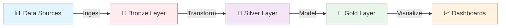
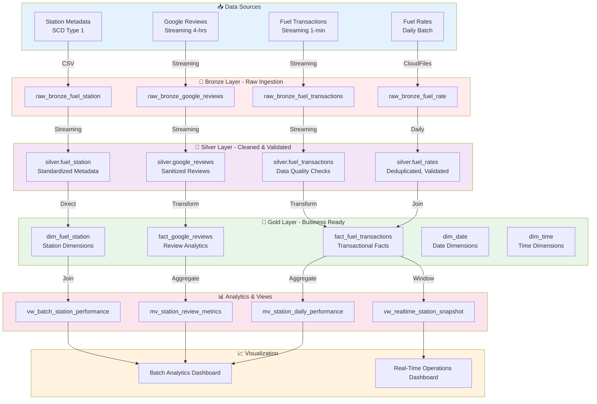
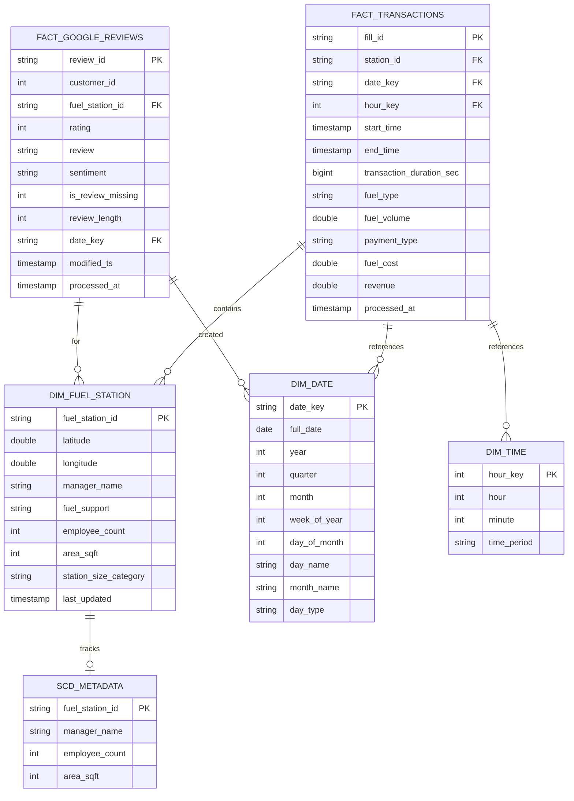
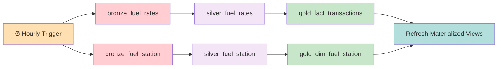
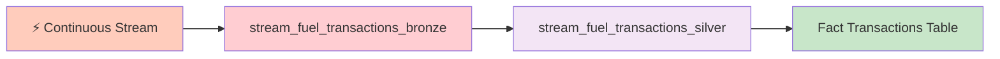
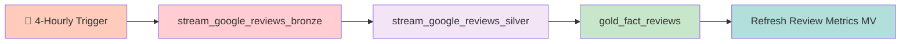
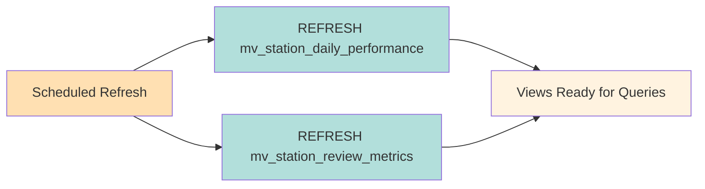

# 🚗 Fuel Data Engineering Project - Databricks

A **production-grade data engineering solution** built on Databricks for a multi-branch fuel station network operating across India. This project demonstrates enterprise-level data architecture with streaming and batch processing pipelines, dimensional modeling, and real-time analytics.

---

## 📋 Table of Contents

- [Project Overview](#project-overview)
- [Architecture](#architecture)
- [Data Model](#data-model)
- [Project Structure](#project-structure)
- [Data Pipeline](#data-pipeline)
- [Database Schema](#database-schema)
- [Dashboards & Analytics](#dashboards--analytics)
- [Setup & Deployment](#setup--deployment)
- [Key Features](#key-features)

---

## 🎯 Project Overview

### Business Context

- **Organization**: Multi-branch fuel station network with 100 stations across India (Station IDs: F001-F100)
- **Objective**: Leverage data analytics combined with customer sentiment to make data-driven business decisions
- **Fuel Types**: Petrol, Diesel, and CNG
- **Data Sources**:
  - Daily fuel rate updates
  - Real-time fuel transaction streams
  - Continuous Google Reviews ingestion
  - Fuel station metadata

### Key Capabilities

✅ **Real-time Transaction Processing** - 1-minute granularity for fuel transactions
✅ **Sentiment Analysis** - Google Reviews integration with sentiment classification
✅ **Daily Performance Analytics** - Station-level KPI aggregation
✅ **Production-Grade Setup** - Databricks Asset Bundles (DABs) for DevOps automation
✅ **Streaming + Batch Architecture** - Hybrid approach for different use cases
✅ **Interactive Dashboards** - Real-time and batch analytics visualization

---

## 🏗️ Architecture

### High-Level Data Flow Architecture



### End-to-End Data Pipeline Architecture



---

## 📊 Data Model

### Dimensional Model Structure



---

## 🗂️ Project Structure

```
fuel-project-databricks/
├── 📄 README.md                                    # Project documentation
├── 📄 databricks.yml                               # DAB configuration (Dev/Prod)
│
├── 📁 resources/                                   # Job & Pipeline Orchestration
│   ├── fuel_project_pipeline.yml                   # Batch pipeline (hourly)
│   ├── fuel_project_streaming_fuel_transactions_ingestion.yml  # Transactions stream
│   ├── fuel_project_streaming_google_reviews_ingestion.yml     # Reviews stream
│   └── refresh_mat_view.yml                        # Materialized view refresh
│
└── 📁 src/
    ├── 📁 dashboards/
    │   ├── Batch Analytics Dashboard.lvdash.json           # Business metrics
    │   └── Real-Time Operations Dashboard.lvdash.json      # Live operations
    │
    └── 📁 notebooks/
        ├── refreshMatViews.sql                     # MV refresh script
        │
        ├── 📁 bronze/                              # Raw Data Ingestion
        │   ├── raw_bronze_fuel_rate.ipynb          # Daily fuel rates loading
        │   ├── raw_bronze_fuel_station.ipynb       # Station metadata loading
        │   ├── raw_bronze_fuel_transactions.ipynb  # Transaction stream ingestion
        │   └── raw_bronze_google_reviews.ipynb     # Reviews stream ingestion
        │
        ├── 📁 silver/                              # Data Cleaning & Validation
        │   ├── bronze_silver_fuel_rates.ipynb      # Rate validation & dedup
        │   ├── bronze_silver_fuel_station.ipynb    # Metadata standardization
        │   ├── bronze_silver_fuel_transactions.ipynb  # Transaction cleanup
        │   └── bronze_silver_google_reviews.ipynb  # Review sanitization
        │
        └── 📁 gold/                                # Business-Ready Analytics
            ├── dim_date.ipynb                      # Date dimension (2024-2026)
            ├── dim_time.ipynb                      # Time dimension
            ├── dim_fuel_station.ipynb              # Station dimension with categorization
            ├── fact_fuel_transactions.ipynb        # Transaction facts with revenue calc
            ├── fact_google_reviews.ipynb           # Review facts with sentiment
            ├── mv_station_daily_performance.ipynb  # Materialized view: daily KPIs
            ├── mv_station_review_metrics.ipynb     # Materialized view: review analytics
            ├── vw_batch_station_performance.ipynb  # Batch view: comprehensive dashboard data
            └── vw_realtime_station_snapshot.ipynb  # Real-time view: last hour snapshot
```

---

## 🔄 Data Pipeline

### 1. Batch Processing Pipeline (Hourly)

**Configuration**: [fuel_project_pipeline.yml](resources/fuel_project_pipeline.yml)



**Tasks**:

1. **bronze_fuel_rates** - Load daily fuel rate CSVs with schema validation
2. **bronze_fuel_station** - Load station metadata with schema evolution
3. **silver_fuel_rates** - Deduplicate, validate, and UPSERT into Silver
4. **silver_fuel_station** - SCD Type 1 dimension maintenance
5. **gold_fact_transactions** - Join transactions with rates and calculate revenue
6. **gold_dim_fuel_station** - Categorize stations by size, add business logic
7. **Refresh_Materialized_Views** - Refresh daily performance views

### 2. Fuel Transactions Streaming (1-Minute Granularity)

**Configuration**: [fuel_project_streaming_fuel_transactions_ingestion.yml](resources/fuel_project_streaming_fuel_transactions_ingestion.yml)



**Processing Time**: 30 seconds micro-batches
**Data Format**: JSON from cloud storage
**Schema Evolution**: Rescue mode enabled

### 3. Google Reviews Streaming (4-Hourly)

**Configuration**: [fuel_project_streaming_google_reviews_ingestion.yml](resources/fuel_project_streaming_google_reviews_ingestion.yml)



**Processing Mode**: `availableNow` - processes all available files once per trigger
**Sentiment Classification**:

- ⭐⭐⭐⭐⭐ Rating 4-5 → Positive
- ⭐⭐⭐ Rating 3 → Neutral
- ⭐⭐ Rating 1-2 → Negative

### 4. Materialized View Refresh

**Configuration**: [refresh_mat_view.yml](resources/refresh_mat_view.yml)



---

## 🗄️ Database Schema

### Layer: 🥉 BRONZE (Raw Ingestion)

#### `bronze.fuel_rates`

Raw fuel rate data as ingested from CSV files.

| Column                        | Type      | Description                    |
| ----------------------------- | --------- | ------------------------------ |
| `fuel_station_id`             | STRING    | Station identifier (F001-F100) |
| `fuel_rate_id`                | STRING    | Unique rate record ID          |
| `fuel_type`                   | STRING    | Petrol, Diesel, or CNG         |
| `fuel_cost`                   | DOUBLE    | Price per liter                |
| `start_datetime`              | TIMESTAMP | Rate effective from            |
| `end_datetime`                | TIMESTAMP | Rate effective until           |
| `_bronze_ingestion_timestamp` | TIMESTAMP | Processing timestamp           |
| `_bronze_source_file_path`    | STRING    | Source file path               |

#### `bronze.fuel_transactions`

Streamed transaction records (1-min granularity).

| Column                        | Type      | Description                    |
| ----------------------------- | --------- | ------------------------------ |
| `fill_id`                     | STRING    | Unique transaction identifier  |
| `station_id`                  | STRING    | Station identifier (F001-F100) |
| `start_time`                  | TIMESTAMP | Transaction start              |
| `end_time`                    | TIMESTAMP | Transaction end                |
| `fuel_type`                   | STRING    | Petrol, Diesel, or CNG         |
| `fuel_volume`                 | DOUBLE    | Liters dispensed (0.5-100L)    |
| `payment_type`                | STRING    | Cash/Credit/Debit/UPI/Multiple |
| `_bronze_ingestion_timestamp` | TIMESTAMP | Ingestion time                 |
| `_bronze_source_file_path`    | STRING    | Source path                    |
| `load_id`                     | STRING    | Batch load identifier          |

#### `bronze.google_reviews`

Streamed review records with customer sentiment.

| Column                        | Type      | Description                         |
| ----------------------------- | --------- | ----------------------------------- |
| `review_id`                   | STRING    | Unique review identifier            |
| `customer_id`                 | INT       | Customer ID (4-digit)               |
| `fuel_station_id`             | STRING    | Station identifier (F001-F100)      |
| `rating`                      | INT       | Rating 1-5 stars                    |
| `review`                      | STRING    | Review text (10-1000 chars or NULL) |
| `modified_ts`                 | TIMESTAMP | Review timestamp                    |
| `_bronze_ingestion_timestamp` | TIMESTAMP | Ingestion time                      |
| `_bronze_source_file_path`    | STRING    | Source path                         |
| `load_id`                     | STRING    | Batch load identifier               |

#### `bronze.fuel_station`

Station metadata (SCD Type 1).

| Column            | Type      | Description                    |
| ----------------- | --------- | ------------------------------ |
| `fuel_station_id` | STRING    | Station identifier (F001-F100) |
| `location`        | STRING    | Geographic location            |
| `manager_name`    | STRING    | Station manager name           |
| `fuel_support`    | STRING    | Supported fuels (array)        |
| `employee_count`  | INT       | Staff count (4-12)             |
| `area_sqft`       | INT       | Station area (4000-10000 sqft) |
| `_ingestion_ts`   | TIMESTAMP | Ingestion time                 |
| `_source_file`    | STRING    | Source file path               |

---

### Layer: 🥈 SILVER (Cleaned & Validated)

#### `silver.fuel_rates`

**Purpose**: Deduplicated, validated fuel rates ready for analytics.  
**Storage**: Delta with clustering on `(fuel_station_id, fuel_type)`

- Schema same as Bronze but with data quality validations applied
- Duplicates removed based on station, fuel type, and start time
- UPSERT pattern for idempotent updates
- Only rates from last 24 hours retained

#### `silver.fuel_transactions`

**Purpose**: Cleaned transaction stream with data quality checks.

- Standardized field names and types
- Event date extracted for partitioning
- Merged schema evolution enabled
- Append-only for streaming integrity

#### `silver.google_reviews`

**Purpose**: Sanitized reviews with text cleanup.

- Removed sensitive PII if present
- Text standardization and length validation
- NULL handling for missing reviews
- Streaming deduplication

#### `silver.fuel_station`

**Purpose**: SCD Type 1 dimension - latest station metadata.

- Location standardization
- Consistent manager and employee info
- Array field validation for fuel support

---

### Layer: 🥇 GOLD (Business-Ready)

#### Dimension Tables

##### `gold.dim_fuel_station`

Station dimension with business categorization.

| Column                  | Type      | Description                        |
| ----------------------- | --------- | ---------------------------------- |
| `fuel_station_id`       | STRING    | PK: Station ID (F001-F100)         |
| `latitude`              | DOUBLE    | Station latitude                   |
| `longitude`             | DOUBLE    | Station longitude                  |
| `manager_name`          | STRING    | Current manager                    |
| `fuel_support`          | STRING    | Supported fuel types array         |
| `employee_count`        | INT       | Number of employees                |
| `area_sqft`             | INT       | Station area in sqft               |
| `station_size_category` | STRING    | Small/Medium/Large (based on sqft) |
| `last_updated`          | TIMESTAMP | SCD Type 1 timestamp               |

**Size Categories**:

- Small: < 6000 sqft
- Medium: 6000-8000 sqft
- Large: > 8000 sqft

##### `gold.dim_date`

Date dimension spanning 2024-2026.

| Column         | Type   | Description             |
| -------------- | ------ | ----------------------- |
| `date_key`     | STRING | PK: YYYYMMDD format     |
| `full_date`    | DATE   | Calendar date           |
| `year`         | INT    | Calendar year           |
| `quarter`      | INT    | Quarter (1-4)           |
| `month`        | INT    | Month (1-12)            |
| `week_of_year` | INT    | ISO week                |
| `day_of_month` | INT    | Day (1-31)              |
| `day_name`     | STRING | Monday, Tuesday, etc.   |
| `month_name`   | STRING | January, February, etc. |
| `day_type`     | STRING | Weekday or Weekend      |

##### `gold.dim_time`

Time dimension for hourly granularity.

| Column        | Type   | Description                     |
| ------------- | ------ | ------------------------------- |
| `hour_key`    | INT    | PK: Hour (0-23)                 |
| `hour`        | INT    | Hour of day                     |
| `minute`      | INT    | Minute of hour                  |
| `time_period` | STRING | Morning/Afternoon/Evening/Night |

---

#### Fact Tables

##### `gold.fact_fuel_transactions`

Transaction facts with calculated revenue.

| Column                     | Type      | Description                     |
| -------------------------- | --------- | ------------------------------- |
| `fill_id`                  | STRING    | PK: Transaction ID              |
| `station_id`               | STRING    | FK: Station ID                  |
| `date_key`                 | STRING    | FK: Date key YYYYMMDD           |
| `hour_key`                 | INT       | FK: Hour (0-23)                 |
| `start_time`               | TIMESTAMP | Transaction start               |
| `end_time`                 | TIMESTAMP | Transaction end                 |
| `transaction_duration_sec` | BIGINT    | Duration in seconds             |
| `fuel_type`                | STRING    | Petrol/Diesel/CNG               |
| `fuel_volume`              | DOUBLE    | Liters dispensed                |
| `payment_type`             | STRING    | Payment method                  |
| `fuel_cost`                | DOUBLE    | Price per liter from rate table |
| `revenue`                  | DOUBLE    | fuel_volume × fuel_cost         |
| `processed_at`             | TIMESTAMP | Processing timestamp            |

**Clustering**: By (station_id, date_key) for query performance

##### `gold.fact_google_reviews`

Review facts with sentiment analysis.

| Column              | Type      | Description                 |
| ------------------- | --------- | --------------------------- |
| `review_id`         | STRING    | PK: Review ID               |
| `customer_id`       | INT       | Customer identifier         |
| `fuel_station_id`   | STRING    | FK: Station ID              |
| `rating`            | INT       | Rating 1-5                  |
| `review`            | STRING    | Review text (NULL possible) |
| `sentiment`         | STRING    | Positive/Neutral/Negative   |
| `is_review_missing` | INT       | 1 if review is NULL, else 0 |
| `review_length`     | INT       | Character count of review   |
| `date_key`          | STRING    | FK: Date key YYYYMMDD       |
| `modified_ts`       | TIMESTAMP | Review creation timestamp   |
| `processed_at`      | TIMESTAMP | Processing timestamp        |

**Clustering**: By (fuel_station_id, date_key)

---

#### Materialized Views

##### `gold.mv_station_daily_performance`

**Purpose**: Daily KPI aggregation by station.  
**Refresh**: Hourly via scheduled job

| Column                        | Type   | Metric Description             |
| ----------------------------- | ------ | ------------------------------ |
| `station_id`                  | STRING | Station identifier             |
| `date_key`                    | STRING | Business date                  |
| `total_transactions`          | INT    | Transaction count              |
| `total_volume_liters`         | DOUBLE | Total fuel volume dispensed    |
| `total_revenue`               | DOUBLE | Total revenue generated        |
| `avg_revenue_per_transaction` | DOUBLE | Average transaction value      |
| `avg_volume_per_transaction`  | DOUBLE | Average liters per transaction |
| `petrol_count`                | INT    | Petrol transactions            |
| `diesel_count`                | INT    | Diesel transactions            |
| `cng_count`                   | INT    | CNG transactions               |
| `petrol_revenue`              | DOUBLE | Revenue from Petrol            |
| `diesel_revenue`              | DOUBLE | Revenue from Diesel            |
| `cng_revenue`                 | DOUBLE | Revenue from CNG               |

##### `gold.mv_station_review_metrics`

**Purpose**: Daily review sentiment metrics by station.  
**Refresh**: Hourly via scheduled job

| Column                 | Type   | Metric Description      |
| ---------------------- | ------ | ----------------------- |
| `fuel_station_id`      | STRING | Station identifier      |
| `date_key`             | STRING | Business date           |
| `total_reviews`        | INT    | Total reviews received  |
| `avg_rating`           | DOUBLE | Average star rating     |
| `positive_reviews`     | INT    | Rating 4-5 count        |
| `neutral_reviews`      | INT    | Rating 3 count          |
| `negative_reviews`     | INT    | Rating 1-2 count        |
| `reviews_without_text` | INT    | Null review count       |
| `avg_review_length`    | DOUBLE | Average character count |

---

#### Business Views

##### `gold.vw_batch_station_performance`

**Purpose**: Comprehensive dashboard view combining transactions and reviews.

- Joins: Fact Transactions → Dim Station → Dim Date → Review Metrics
- Calculated Column: `revenue_per_employee` = total_revenue / employee_count
- Includes station characteristics, performance metrics, and sentiment

##### `gold.vw_realtime_station_snapshot`

**Purpose**: Last 1-hour snapshot for real-time monitoring.

- Window: Last 1 hour transactions
- Metrics: Transactions count, revenue, volume, avg transaction duration
- Last transaction timestamp for monitoring

---

## 📈 Dashboards & Analytics

### 1. **Batch Analytics Dashboard**

**File**: [Batch Analytics Dashboard.lvdash.json](src/dashboards/Batch%20Analytics%20Dashboard.lvdash.json)

**Purpose**: Historical analysis and business intelligence

**Key Visualizations**:

- 📊 Daily revenue by station and fuel type
- 🏆 Top performing stations by revenue
- 📍 Geographic heatmap (latitude/longitude)
- ⭐ Average rating by station
- 💬 Sentiment distribution (Positive/Neutral/Negative)
- 👥 Revenue per employee efficiency metric
- 📈 Trend analysis over time
- 🔍 Station size category performance comparison

**Refresh**: Hourly after pipeline completion
**Users**: Management, Business Analysts, Finance

---

### 2. **Real-Time Operations Dashboard**

**File**: [Real-Time Operations Dashboard.lvdash.json](src/dashboards/Real-Time%20Operations%20Dashboard.lvdash.json)

**Purpose**: Live operations monitoring

**Key Visualizations**:

- ⚡ Transactions in last hour (by station)
- 💰 Live revenue (last hour)
- 🚗 Volume dispensed (current period)
- ⏱️ Average transaction duration
- 🟢 Active stations count
- 📊 Real-time fuel type split
- 🗺️ Station status map
- 🔔 Latest transaction feed

**Refresh**: Real-time (1-5 min granularity)
**Users**: Operations Team, Station Managers

---

## ⚙️ Setup & Deployment

### Databricks Asset Bundles (DABs)

This project uses **Databricks Asset Bundles** for infrastructure-as-code deployment.

#### Configuration Structure

**[databricks.yml](databricks.yml)**

```yaml
bundle:
  name: fuel-project-databricks

# Development Environment (default)
targets:
  dev:
    mode: development
    default: true
    workspace:
      host: https://adb-7405614629048942.2.azuredatabricks.net

  # Production Environment with Service Principal
  prod:
    mode: production
    workspace:
      host: https://adb-7405614629048942.2.azuredatabricks.net
      root_path: /Workspace/Shared/.bundle/${bundle.name}/${bundle.target}
    run_as:
      service_principal_name: b426a65a-1aad-4733-96d6-4e8d88919b02
```

#### Deployment Steps

1. **Initialize Bundle**

   ```bash
   databricks bundle validate
   ```

2. **Deploy to Development**

   ```bash
   databricks bundle deploy --target dev
   ```

3. **Deploy to Production**

   ```bash
   databricks bundle deploy --target prod
   ```

4. **Run Pipelines**
   ```bash
   databricks bundle run fuel_project_pipeline --target prod
   ```

---

## 🎯 Key Features

### 🔐 Data Quality & Governance

| Feature               | Implementation                                   |
| --------------------- | ------------------------------------------------ |
| **Schema Validation** | FAILFAST mode on Bronze ingestion                |
| **Deduplication**     | Duplicate removal on key columns at Silver layer |
| **Data Completeness** | NULL checks and validation rules                 |
| **Idempotency**       | UPSERT patterns with merge operations            |
| **Schema Evolution**  | CloudFiles with rescue/addNewColumns modes       |
| **Lineage Tracking**  | Source file paths and ingestion timestamps       |

### ⚡ Performance Optimization

| Feature                   | Details                                             |
| ------------------------- | --------------------------------------------------- |
| **Delta Lake Clustering** | Clustered on (station_id, date_key) for query speed |
| **Auto-optimize**         | Delta autoCompact and optimizeWrite enabled         |
| **Partition Pruning**     | Date-based partitioning for faster scans            |
| **Materialized Views**    | Pre-aggregated metrics for dashboard queries        |
| **Queue Management**      | All jobs use priority queue for fair scheduling     |
| **Performance Target**    | PERFORMANCE_OPTIMIZED for batch pipeline            |

### 📊 Real-Time Analytics

| Feature                    | Specification                                |
| -------------------------- | -------------------------------------------- |
| **Transactions Streaming** | 30-second micro-batch processing             |
| **Reviews Streaming**      | 4-hour batch-like ingestion (availableNow)   |
| **Revenue Calculation**    | Real-time computation during transformation  |
| **Sentiment Analysis**     | Immediate classification on review ingestion |
| **1-Hour Window**          | Real-time view captures last 60 minutes      |

### 🏢 Production Readiness

| Feature                    | Details                                        |
| -------------------------- | ---------------------------------------------- |
| **Environment Separation** | Dev/Prod targets with different configurations |
| **Email Notifications**    | Success/failure alerts to operations team      |
| **Service Principal Auth** | Production uses managed service account        |
| **DAB Deployment**         | Version-controlled infrastructure              |
| **Checkpoint Management**  | Streaming checkpoints for fault recovery       |
| **Job Queue**              | Automated scheduling with dependencies         |

### 💼 Business Intelligence

| Capability               | Use Cases                            |
| ------------------------ | ------------------------------------ |
| **Station Comparison**   | Identify high/low performers         |
| **Revenue Tracking**     | Daily revenue by station & fuel type |
| **Customer Sentiment**   | Monitor review sentiment by location |
| **Efficiency Metrics**   | Revenue per employee analysis        |
| **Operational Insights** | Transaction patterns and peak hours  |
| **Geographic Analysis**  | Map-based performance visualization  |

---

## 📝 Data Flow Summary

### Batch Path (Hourly)

```
CSV Raw Files → Bronze (Fail-Fast) → Silver (Dedupe & Validate)
  → Gold (Join & Aggregate) → MV Refresh → Dashboard
```

### Streaming Path (Continuous)

```
JSON Stream → Bronze (30s) → Silver (Merged) → Gold (Real-time)
  → Fact Tables → Views → Dashboard
```

### Sentiment Path (4-Hourly)

```
Reviews JSON → Bronze (Available Now) → Silver (Sanitize)
  → Gold (Sentiment + Classification) → MV → Dashboard
```

---

## 🔧 Technologies Used

- **Platform**: Databricks (Azure)
- **Compute**: Apache Spark (PySpark)
- **Storage**: Delta Lake (ACID transactions)
- **Orchestration**: Databricks Workflows
- **Infrastructure**: Databricks Asset Bundles (DAB)
- **Query**: SQL (Spark SQL)
- **Visualization**: Databricks Dashboards (Lakeview)
- **Version Control**: Git/GitHub

---

## 📋 Checklists

### ✅ Project Components

- [x] Bronze layer with 4 data sources
- [x] Silver layer with data quality
- [x] Gold layer with dimensional model
- [x] Materialized views for performance
- [x] Business views for analytics
- [x] Batch pipeline (hourly)
- [x] Streaming pipelines (1-min + 4-hourly)
- [x] Real-time dashboard
- [x] Batch analytics dashboard
- [x] DAB production configuration

### ✅ Data Entities

- [x] Fuel Station (SCD Type 1, 100 records)
- [x] Fuel Transactions (Continuous stream, 1-min granularity)
- [x] Fuel Rates (Daily batch)
- [x] Google Reviews (4-hourly streaming)

### ✅ Fuel Types Support

- [x] Petrol
- [x] Diesel
- [x] CNG

---

## 📞 Support

For questions or issues regarding this project, please refer to the respective notebook documentation in the `src/notebooks` directory.

---

**Last Updated**: January 2026  
**Status**: ✅ Production Ready
